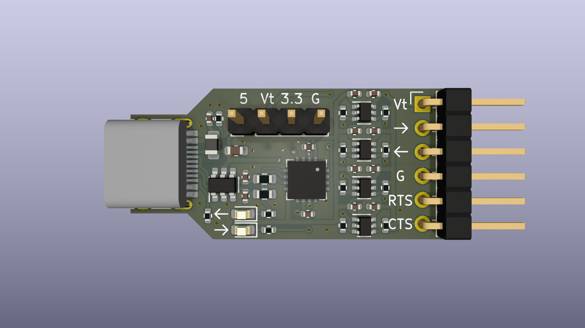

# usb-uart-shift

This is an FT230X-based USB-UART adapter with built-in level shifting. This
allows talking to targets using different I/O voltage levels (1.8V to 5V), but
it's especially useful to avoid backpowering a target through the TX line.

This board can be assembled by JLCPCB PCBA for about $5 each, see the `fab/`
directory for Gerber/BOM/CPL data.

## Usage

The I/Os on the right-angle header (J1) are:

 * `->` (output, UART TX from the perspective of the adapter)
 * `<-` (input, RX)
 * `G` (GND)
 * `RTS` (output)
 * `CTS` (input)

The pins are arranged such that a 4-pin receptacle on the target is sufficient
when designing specifically for interfacing with this adapter if flow control
is not needed.

Level-shifting is configured through the 4-pin header (J2). When the I/O
reference voltage is available from the target it is recommended to connect it
to `Vt` and leave J2 open.

Alternatively, you can connect a jumper between `3.3` and `Vt` or `5` and `Vt`
on J2 to set the I/O voltage to 3.3V or 5V (strictly speaking USB VBUS),
respectively. However, in this case we cannot detect an unpowered target and
the usual backpowering considerations will apply. You can also just connect a
lab power supply to `Vt` and `G`.
